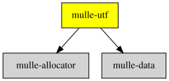

# mulle-utf

#### 🔤 UTF8-16-32 analysis and manipulation library

It is a C (C99) library to analyze and convert unicode strings. It also
contains some limited `<string.h>` like functionality for UTF16 and UTF32.
It is the backbone of **NSString**.


| Release Version                                       | Release Notes  | AI Documentation
|-------------------------------------------------------|----------------|---------------
|  [](//github.com/mulle-c/mulle-utf/actions)  | [RELEASENOTES](RELEASENOTES.md) | [DeepWiki for mulle-utf](https://deepwiki.com/mulle-c/mulle-utf)


## API

* [API Overview](asset/dox/api/toc)

| Documentation                          | Description                                      |
|----------------------------------------|--------------------------------------------------|
| [`mulle_char7`](dox/API_CHAR7.md)      | Encode small ASCII strings into integers         |
| [`mulle_char5`](dox/API_CHAR5.md)      | Encode some more smallish ASCII strings integers |
| [conversion](dox/API_CONVERSION.md)    | Character and string conversions                 |
| [information](dox/API_INFORMATION.md)  | Analyze and classify string encodings            |
| [string](dox/API_STRING.md)            | Primitive UTF16 and UTF32 string handling        |

For character type classification (`is_alphanumeric`, `is_whitespace`,
`tolower`, `toupper`, etc.) see
[mulle-unicode](//github.com/mulle-c/mulle-unicode).

`size_t` is used for byte-sized (really `char`-sized) lengths. UTF16 and
UTF32 use `size_t`.


### You are here




## Add

mulle-utf is a component of the [mulle-core](//github.com/mulle-core/mulle-core) library. So in your code include the mulle-core umbrella header:

``` c
#include <mulle-core/mulle-core.h>
```

### Add mulle-core to a cmake and git project

``` bash
git submodule add https://github.com/mulle-core/mulle-core.git mulle-core
```

Add this to your `CMakeLists.txt`:

``` cmake
add_subdirectory( mulle-core)
target_link_libraries( ${PROJECT_NAME} PRIVATE mulle-core)
```


### Add mulle-core to a mulle-sde project

``` sh
mulle-sde add github:mulle-core/mulle-core
```

### Embed mulle-utf with clib

``` sh
clib install --out src mulle-c/mulle-utf
```

Append `src` to your include path (e.g. add `-isystem src`  to your `CFLAGS`)
and compile all the sources that were downloaded.


## Author

[Nat!](https://mulle-kybernetik.com/weblog) for Mulle kybernetiK  


