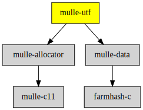

# mulle-utf

#### 🔤 UTF8-16-32 analysis and manipulation library

It is a C (C99) library to analyze and convert unicode strings. It also
contains some limited `<string.h>` like functionality for UTF16 and UTF32.
It is the backbone of **NSString**.


| Release Version                                       | Release Notes
|-------------------------------------------------------|--------------
|  [](//github.com/mulle-c/mulle-utf/actions)  | [RELEASENOTES](RELEASENOTES.md) |


## API

| Documentation                          | Description                                      |
|----------------------------------------|--------------------------------------------------|
| [`mulle_char7`](dox/API_CHAR7.md)      | Encode small ASCII strings into integers         |
| [`mulle_char5`](dox/API_CHAR5.md)      | Encode some more smallish ASCII strings integers |
| [ctype](dox/API_CTYPE.md)              | Character type information                       |
| [conversion](dox/API_CONVERSION.md)    | Character and string conversions                 |
| [information](dox/API_INFORMATION.md)  | Analyze and classify string encodings            |
| [string](dox/API_STRING.md)            | Primitive UTF16 and UTF32 string handling        |

`size_t` is used for byte-sized (really `char`-sized) lengths. UTF16 and
UTF32 use `size_t`.


### You are here




## Add

**This project is a component of the [mulle-core](//github.com/mulle-core/mulle-core) library. As such you usually will *not* add or install it
individually, unless you specifically do not want to link against
`mulle-core`.**


### Add as an individual component

Use [mulle-sde](//github.com/mulle-sde) to add mulle-utf to your project:

``` sh
mulle-sde add github:mulle-c/mulle-utf
```

To only add the sources of mulle-utf with dependency
sources use [clib](https://github.com/clibs/clib):


``` sh
clib install --out src/mulle-c mulle-c/mulle-utf
```

Add `-isystem src/mulle-c` to your `CFLAGS` and compile all the sources that were downloaded with your project.


## Install

Use [mulle-sde](//github.com/mulle-sde) to build and install mulle-utf and all dependencies:

``` sh
mulle-sde install --prefix /usr/local \
   https://github.com/mulle-c/mulle-utf/archive/latest.tar.gz
```

### Legacy Installation

Install the requirements:

| Requirements                                 | Description
|----------------------------------------------|-----------------------
| [mulle-allocator](https://github.com/mulle-c/mulle-allocator)             | 🔄 Flexible C memory allocation scheme
| [mulle-data](https://github.com/mulle-c/mulle-data)             | #️⃣ A collection of hash functions

Download the latest [tar](https://github.com/mulle-c/mulle-utf/archive/refs/tags/latest.tar.gz) or [zip](https://github.com/mulle-c/mulle-utf/archive/refs/tags/latest.zip) archive and unpack it.

Install **mulle-utf** into `/usr/local` with [cmake](https://cmake.org):

``` sh
cmake -B build \
      -DCMAKE_INSTALL_PREFIX=/usr/local \
      -DCMAKE_PREFIX_PATH=/usr/local \
      -DCMAKE_BUILD_TYPE=Release &&
cmake --build build --config Release &&
cmake --install build --config Release
```


## Author

[Nat!](https://mulle-kybernetik.com/weblog) for Mulle kybernetiK  


